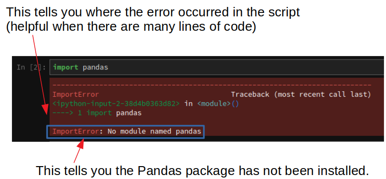
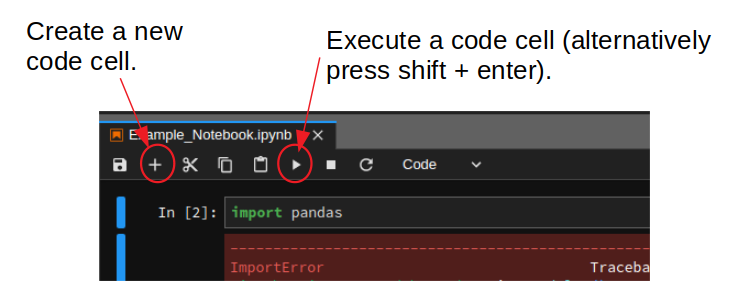
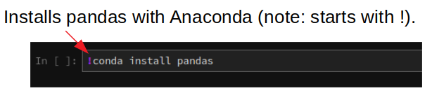

# Vorwort

Dieses Juypter-Book besteht aus einer Reihe interaktiver Jupyter-Notebooks zum Thema Wassermengenwirtschaft und Klimawandel. Es wurde ursprünglich von [Dan Kovacek](https://civil.ubc.ca/faculty/dan-kovacek/) und [Steven Weijs](https://Civil.ubc.ca/faculty/steven-weijs/) an der University of British Columbia erstellt und von [Gregor Johnen](https://www.uni-due.de/wasserbau/mitarbeiter_johnen.php) und [Johanna Schimanski](https://www.uni-due.de/wasserbau/schimanski.php) ins Deutsche übersetzt, angepasst und stetig erweitert. Ziel der einzelnen Notebooks ist es, Studierenden die systematische Datenanalyse mithilfe der Open-Source-Software *Python* und *Jupyter-Notebooks* näherzubringen.

**Es wird nicht erwartet, dass Teilnehmende über Vorkenntnisse der Programmierung verfügen.** Der Schwerpunkt der Notebooks liegt auf hydrologischen Konzepten und nicht auf der Programmierung selbst, weshalb der erforderliche Code zum Großteil bereitgestellt wird. Jedes Notebook konzentriert sich auf eine bestimmte Komponente der hydrologischen Datenanalyse- und Auswertung. Anschließend sollten Fragen zu den zugrunde liegenden Konzepten beantwortet werden. Dies erfordert möglicherweise das Ändern von Variablen und das erneute Ausführen von Codeblöcken, um die Ergebnisse im Anschluss zu aktualisieren.

>**Anmerkung**: Der Inhalt dieser Notebooks stellt keine vorgeschriebene bzw. normierte Kombination von Methoden für hydrologische Analysen dar. Vielmehr sollen einige grundlegende Konzepte aus dem Bereich Wassermengenwirtschaft und Klimawandelanalyse vorgestellt werden und so zum Nachdenken über Modellunsicherheiten und Sensitivitäten anregen.

## Erste Schritte mit interaktiven Python-Notebooks

Die Jupyter-Notebooks in diesem Kurs können auf die folgenden Arten aufgerufen und ausgeführt werden:

### Option 1: Lokale Installation (Empfohlen)

Hier wird der Paket- und Umgebungsmanager [Anaconda](https://www.anaconda.com/) empfohlen. Die Programmierung in Python ist so vielseitig und leistungsstark, weil sie leistungsstarke Funktionen verwendet, die in anwendungsspezifischen Bibliotheken (bspw. pandas) geschrieben sind. Anaconda ist die Software, die sicherstellt, dass bei der Nutzung mehrerer solcher Pakete alles reibungslos läuft und keine Versionskonflikte entstehen. Im Fokus steht dabei ein simples Management von Paketen und Entwicklungsumgebungen. Dank dieses Tools muss nicht jedes Paket separat installiert werden, sondern bei der Installation werden Python und die wichtigsten Pakete für die Datenanalyse automatisch mitinstalliert, was den Einstieg erheblich erleichtert.

>**Anmerkung**: Für die lokale Installation empfehlen wir die [Anaconda Distribution](https://www.anaconda.com/download/success). Sie installiert Python und viele nützliche Pakete auf einmal, was besonders für Anfänger praktisch ist. Anaconda hat kürzlich eine sog. Paywall eingeführt. Dieses Abonnement ist aber grundsätzlich nicht notwendig, um die Software für akademische Zwecke zu nutzen.

Nach der Installation von Anaconda kann im Anschluss [Jupyter Notebook](https://jupyter.org/) verwendet werden, da es bereits enthalten ist. Eine detaillierte Anleitung zur Installation von Python über Anaconda findet man [hier](https://www.anaconda.com/products/distribution).

**Installationsschritte:**

1.  Installieren Sie Anaconda über den oben genannten Link.
2.  Öffnen Sie die 'Anaconda Prompt' (unter Windows) oder das Terminal (unter macOS/Linux).
3.  Jupyter Notebook ist bereits Teil der Anaconda Distribution. Sie müssen es nicht separat installieren.
4.  Überprüfen Sie die Installation, indem Sie folgende Befehle eingeben und jeweils mit Enter bestätigen:
    *   `python --version`
    *   `conda --version`
    *   `jupyter notebook --version`
    Es sollten die jeweiligen Versionsnummern angezeigt werden.
5.  Starten Sie Jupyter Notebook, indem Sie `jupyter notebook` in die Anaconda Prompt (oder Terminal) eingeben und Enter drücken. Es sollte sich ein neuer Tab in Ihrem Webbrowser öffnen.

### Option 2: Cloud-basierte Nutzung

*   **Mit Binder**: Die Notebooks können alternativ auch "in der Cloud" mit [Binder](https://mybinder.org/) ausgeführt werden. Über Binder kann mit dem Webbrowser auf die Notebooks zugegriffen werden, ohne Python oder Anaconda lokal zu installieren. Binder ist hier eine super Möglichkeit, Code mit anderen zu teilen und Projekte remote bei voller Funktionalität zu präsentieren. **WICHTIG:** Bei Nutzung von Binder werden Ihre Änderungen **nicht dauerhaft gespeichert!** Wenn Sie den Browser-Tab schließen, gehen alle Änderungen verloren. Speichern Sie Ihre Arbeit regelmäßig lokal herunter.

*   **Mit Google Colab**: Eine weitere Möglichkeit, die Notebooks auszuführen, ist die Nutzung von [Google Colab](https://colab.research.google.com/). Colab ist eine kostenlose Cloud-basierte Plattform, die es ermöglicht, Jupyter-Notebooks direkt im Webbrowser auszuführen. Hierfür ist lediglich ein Google-Konto erforderlich. Der Vorteil von Colab liegt darin, dass keine lokale Installation von Python oder Jupyter notwendig ist und dass die Plattform Zugriff auf leistungsstarke Hardware wie GPUs bietet. Änderungen können gespeichert werden, indem das Notebook entweder lokal heruntergeladen oder in Google Drive gespeichert wird. Beachten Sie, dass Sie möglicherweise die Notebook-Dateien (.ipynb) aus diesem Kurs manuell in Colab hochladen oder von GitHub öffnen müssen.

### Einrichtung und Vorbereitung

Eine detaillierte Anleitung zur Installation von Python über Anaconda findet man [hier](https://www.anaconda.com/products/distribution). Nach der Installation von Anaconda ist darauf zu achten, dass Python (Version 3.10 oder höher) korrekt installiert wurde. Überprüfen Sie dies, indem Sie in der Anaconda Prompt `python --version` eingeben. Stellen Sie ebenfalls sicher, dass Jupyter Notebook über die Anaconda Prompt (mit dem Befehl `jupyter notebook`) geöffnet und gestartet werden kann.

**Speichern Ihrer Arbeit:** Denken Sie daran, Ihre Arbeit regelmäßig zu speichern! In Jupyter Notebook geht das über `Datei -> Speichern und Checkpoint erstellen` (oder das Disketten-Symbol in der Werkzeugleiste).

**Der Kernel:** Jede Notebook-Datei wird von einem 'Kernel' ausgeführt, der die Code-Engine ist. Wenn Ihr Code hängen bleibt oder unerwartete Fehler auftreten, kann ein Neustart des Kernels helfen: `Kernel -> Kernel neu starten`.

Für weitere Unterstützung wird im [Moodle-Kurs](https://moodle.uni-due.de/course/view.php?id=12978) ein Diskussionsforum zur Installation eingerichtet. Sollten nach Durchsicht der bereitgestellten Materialien Schwierigkeiten bei der Installation bestehen, können Fragen dort so detailliert wie möglich gestellt werden. Diese werden zeitnah beantwortet.

### Lernressourcen

Es gibt eine große Vielfalt an Programmiersprachen und Paketen innerhalb einer jeweiligen Programmiersprache. Am Anfang kann die Anzahl der neuen Konzepte beim lernen einer Programmiersprace schnell überwältigend sein und es passiert (fast jedem von uns), dass man sich dem nicht gewachsen fühlt:

  
(Quelle: [Gfycat.com](https://gfycat.com/))

Das Internet ist zudem voll von hervorragenden Lernressourcen! Eine Investition in das Erlernen einiger grundlegender Konzepte ist die Zeit definitiv wert. Im Folgenden sind einige Ressourcen aufgelistet, die einem den Einstieg erleichtern:

* [Wie führt man Code in einem Notebook aus](https://nbviewer.org/github/jupyter/notebook/blob/main/docs/source/examples/Notebook/Running%20Code.ipynb). Grundlagen der Python-Syntax und der Programmierung im Jupyter-Notebook.
* [Matplotlib](http://nbviewer.ipython.org/github/jrjohansson/scientific-python-lectures/blob/master/Lecture-4-Matplotlib.ipynb) ist eine beliebte Bibliothek zur Erstellung einer Vielzahl von Diagrammen.
* [Einführung in Python](https://nbviewer.org/github/ehmatthes/intro_programming/blob/master/notebooks/index.ipynb).  Ein Einführungskurs, der anhand eines interaktiven Python-Notizbuchs in Jupyter unterrichtet wird.
* Für die Formatierung von Textzellen in den Notebooks wird Markdown verwendet. Eine Übersicht finden Sie im Kapitel [Markdown Grundlagen](markdown.md).

### Eine umfassende Liste interessanter, nützlicher und leistungsfähiger Jupyter-Notebook-Beispiele findet man [hier](https://github.com/jupyter/jupyter/wiki).

## Weitere Informationen

### Navigation in diesem Jupyter Book

Dieses Jupyter Book ist in Kapitel und Abschnitte gegliedert, die in der Datei `_toc.yml` definiert sind. Wenn Sie das Buch online betrachten oder lokal bauen (siehe README), erscheint am linken Rand eine Navigationsleiste, mit der Sie einfach zwischen den verschiedenen Notebooks und Seiten wechseln können.

### Projektstruktur

Für Ihre Arbeit sind vor allem folgende Ordner relevant:
*   `Inhalt/Notebooks/`: Enthält die interaktiven Übungsnotebooks (`Uebung_X/`) und die Hausarbeit (`Hausarbeit/`).
*   `Inhalt/Notebook_Daten/`: Enthält die Datensätze, die für die Übungen und die Hausarbeit benötigt werden.
*   `Inhalt/Projekt_Daten/`: Enthält zusätzliche Datensätze, die in einigen Notebooks verwendet werden.

### Paket-Installation

Diese Notebooks verwenden Pakete wie `pandas` zur Datenanalyse und `matplotlib` oder `plotly` zur Visualisierung. Wenn Sie eine Fehlermeldung wie 'ModuleNotFoundError' sehen, bedeutet das, dass ein benötigtes Paket fehlt.

Wenn beim Ausführen einer Code-Zelle in Jupyter die folgende Fehlermeldung zurückgegeben wird:



Dies bedeutet im Allgemeinen, dass ein Paket nicht installiert wurde. In diesem Fall handelt es sich um das Paket `Pandas`. Innerhalb einer Anaconda-Umgebung ist es am besten, Pakete mit `conda install <paketname>` zu installieren, um Konflikte zu vermeiden. Dies kann durch Erstellen einer neuen Zelle geschehen:



Es kann folgendes eingegeben werden (Hier kann `pandas` durch den jeweiligen Namen des Pakets ersetzt werden, das installiert werden soll). Führen Sie den Befehl nur einmal pro Paket aus:

```python
!conda install pandas -y
# oder für mehrere Pakete gleichzeitig:
# !conda install numpy pandas matplotlib -y
```


Die Zelle kann nun ausgeführt werden (Umschalttaste + Eingabetaste) (empfohlen), oder durch drücken der Schaltfläche "Ausführen". Das `-y` am Ende überspringt die Bestätigungsabfrage.

### Troubleshooting & Hilfe

Zusätzlich zum Moodle-Forum hier einige Tipps zur Fehlerbehebung:
*   **Fehlermeldungen lesen:** Lesen Sie Fehlermeldungen sorgfältig – oft geben sie genaue Hinweise auf das Problem (z.B. welche Zeile den Fehler verursacht oder welches Paket fehlt).
*   **Online-Suche:** Kopieren Sie die Fehlermeldung und suchen Sie online danach (z.B. auf Google oder Stack Overflow). Oft hatten andere schon das gleiche Problem.
*   **Kernel neu starten:** Wie oben erwähnt, kann ein Neustart des Kernels (`Kernel -> Kernel neu starten`) manchmal helfen, wenn sich das Notebook seltsam verhält.
*   **Hilfe im Forum:** Wenn Sie im Moodle-Forum fragen, beschreiben Sie genau, was Sie versucht haben, welchen Code Sie ausgeführt haben und welche vollständige Fehlermeldung Sie erhalten haben. Screenshots können ebenfalls hilfreich sein.

## Lizenz

Die Notizbücher, aus denen dieses Jupyter-Buch besteht, stehen unter der Lizenz [Creative Commons Attribution 4.0 International](https://creativecommons.org/licenses/by/4.0/legalcode).


