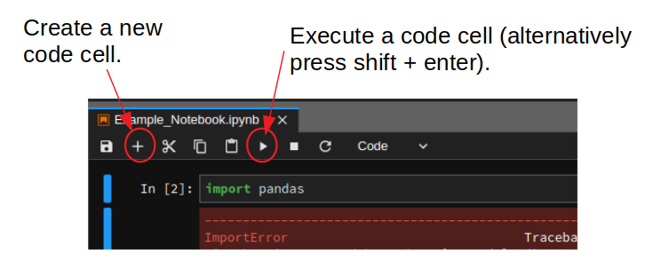
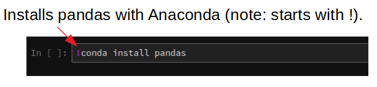

# Vorwort

Dieses Juypter-Book besteht aus einer Reihe interaktiver Jupyter-Notebooks zum Thema Wassermengenwirtschaft und Klimawandel. Es wurde ursprünglich von [Dan Kovacek](https://civil.ubc.ca/faculty/dan-kovacek/) und [Steven Weijs](https://Civil.ubc.ca/faculty/steven-weijs/) an der University of British Columbia erstellt und von [Gregor Johnen](https://www.uni-due.de/wasserbau/mitarbeiter_johnen.php) ins Deutsche übersetzt und angepasst. Ziel der einzelnen Notebooks ist es, Studierenden die systematische Datenanalyse mithilfe der Open-Source-Software *Python* und *Jupyter-Notebooks* näherzubringen.

**Es wird nicht erwartet, dass Teilnehmende über Vorkenntnisse der Programmierung verfügen.** Der Schwerpunkt der Notebooks liegt auf hydrologischen Konzepten und nicht auf der Programmierung selbst, weshalb der erforderliche Code bereitgestellt wird. Jedes Notebook konzentriert sich auf eine bestimmte Komponente der hydrologischen Analyse. Anschließen sollten Fragen zu den zugrunde liegenden Konzepten beantwortet werden. Dies erfordert möglicherweise das Ändern von Variablen und das erneute Ausführen von Codeblöcken, um die Ergebnisse im Anschluss zu aktualisieren.

>**Anmerkung**: Der Inhalt dieser Notebooks stellt keine vorgeschriebene bzw. normierte Kombination von Methoden für hydrologische Analysen dar. Vielmehr sollen einige grundlegende Konzepte vorgestellt werden und so zum Nachdenken über Modellunsicherheiten und Sensitivitäten anregen.

## Erste Schritte mit interaktiven Python-Notebooks

Die Jupyter-Notebooks in diesem Kurs können auf die folgenden Arten aufgerufen und ausgeführt werden:

* **Auf dem lokalen Rechner**: Hier wird der Paket- und Umgebungsmanager [Anaconda](https://www.anaconda.com/) empfohlen. Die Programmierung in Python ist so vielseitig und leistungsstark, weil sie leistungsstarke Funktionen verwendet, die in anwendungsspezifischen Bibliotheken (bspw. pandas) geschrieben sind.  Anaconda ist die Software, die sicherstellt, dass bei der Nutzungen mehrerer solcher Pakete alles reibungslos läuft und keine Versionskonflikte entstehen. Im Fokus steht dabei ein simples Management von Paketen und Entwicklungsumgebungen. Denn dank dieses Tools muss nicht jedes Paket separat installiert werden, sondern bei der Installation werden Python und die wichtigsten Pakete automatisch mitinstalliert. Nach der Installation von Anaconda kann im Anschluss [Jupyter Lab](https://jupyter.org/) installiert werden.
* **In der Cloud**: Die Notebooks können alternativ auch "in der Cloud" mit [Binder](https://mybinder.org/) ausgeführt werden. Über Binder kann mit dem Webbrowser auf die Notebooks zugegriffen werden, ohne Python oder Anaconda lokal zu installieren. Binder ist hier eine super Möglichkeit, Code mit anderen zu teilen und Projekte remote bei voller Funktionalität zu präsentieren. WICHTIG zu beachten ist, dass Dateien, auf die auf diese Weise zugegriffen wird, **nicht in der Cloud-Instanz gespeichert** werden können und dass alle vorgenommenen Änderungen lokal gespeichert oder neu geschrieben werden müssen, sobald die Instanz verlassen wird und später neu gestartet wird.

>**Anmerkung**: Anaconda hat kürzlich eine sog. Paywall eingeführt. Dieses Abonemment ist aber grundsätzlich nicht notwendig, um die Software zu nutzen. Da die komplette Anaconda-Distribution mit allen Paketen lokal sehr viel Speicherplatz verbraucht, gibt es außerdem die Variante [Miniconda](https://docs.conda.io/projects/conda/en/latest/user-guide/install/windows.html), die nur Python, Conda sowie ein paar grundlegende Pakete enthält. Diese erfordert demnach auch eine manuelle Installation der in den Jupyter-Notebooks verwendeten Pakete.  Dieser Installationsprozess ist jedoch nicht schwierig und kann wahlweise direkt im Notebook durchgeführt werden. D.h. die Installation von bspw. numpy und pandas wäre einfach eine Sache des Ausführens von `!conda install numpy pandas` in einem Codeblock&mdash; Es reicht die Pakete einmal zu installieren, es sei denn, man installiert miniconda neu.

### Einrichtung und Vorbereitung

Eine detaillierte Installationsanleitung findet man [hier](https://nbviewer.org/github/ehmatthes/intro_programming/blob/master/notebooks/programming_environment.ipynb). Es ist sicherzustellen, dass Python installiert ist (Version Python 3.8 oder höher) und dass Jupyter Notebook geöffnet und gestartet werden kann. Notiz: Die Installation von Geany ist hierfür nicht zwingend erforderlich.

Im [Moodle-Kurs](https://moodle.uni-due.de/course/view.php?id=12978) wird ein Diskussionsforum zur Installation eingerichtet.  Wenn nach Durchsicht der hier bereitgestellten Materialien immer noch Schwierigkeiten bei der Installation bestehen, können Fragen dort so detailliert wie möglich gestellt werden. Diese werden zeitnah beantwortet.

### Lernressourcen

Es gibt eine große Vielfalt an Programmiersprachen und Paketen innerhalb einer jeweiligen Programmiersprache. Am Anfang kann die Anzahl der neuen Konzepte beim lernen einer Programmiersprace schnell überwältigend sein und es passiert (fast jedem von uns), dass man sich dem nicht gewachsen fühlt:

  
(Quelle: [Gfycat.com](https://gfycat.com/))

Das Internet ist zudem voll von hervorragenden Lernressourcen! Eine Investition in das Erlernen einiger grundlegender Konzepte ist die Zeit definitiv wert. Im Folgenden sind einige Ressourcen aufgelistet, die einem den Einstieg erleichtern:

* [Wie führt man Code in einem Notebook aus](https://nbviewer.org/github/jupyter/notebook/blob/main/docs/source/examples/Notebook/Running%20Code.ipynb). Grundlagen der Python-Syntax und der Programmierung im Jupyter-Notebook.
* [Matplotlib](http://nbviewer.ipython.org/github/jrjohansson/scientific-python-lectures/blob/master/Lecture-4-Matplotlib.ipynb) ist eine beliebte Bibliothek zur Erstellung einer Vielzahl von Diagrammen. 
* [Einführung in Python](https://nbviewer.org/github/ehmatthes/intro_programming/blob/master/notebooks/index.ipynb).  Ein Einführungskurs, der anhand eines interaktiven Python-Notizbuchs in Jupyter unterrichtet wird.

### Eine umfassende Liste interessanter, nützlicher und leistungsfähiger Jupyter-Notebook-Beispiele findet man [hier](https://github.com/jupyter/jupyter/wiki).

## Weitere Informationen

### Paket-Installation

Wenn beim Ausführen einer Code-Zelle in Jupyter die folgende Fehlermeldung zurückgegeben wird:

Dies bedeutet im Allgemeinen, dass ein Paket nicht installiert wurde.  In diesem Fall handelt es sich um das Paket `Pandas`, das durch Erstellen einer neuen Zelle installiert werden kann:

Es kann folgendes eingegeben werden (Hier kann `pandas` durch den jeweiligen Namen des Pakets ersetzt werden, das installiert werden soll)

Die Zelle kann nun ausgeführt werden (Umschalttaste + Eingabetaste) (empfohlen), oder durch drücken der Schaltfläche "Ausführen".

## Lizenz

Die Notizbücher, aus denen dieses Jupyter-Buch besteht, stehen unter der Lizenz [Creative Commons Attribution 4.0 International] (https://creativecommons.org/licenses/by/4.0/legalcode).